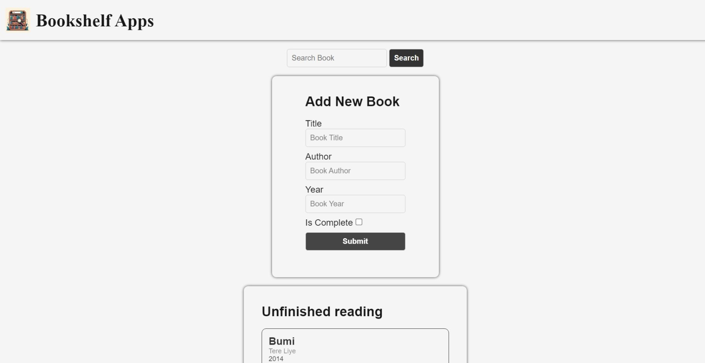
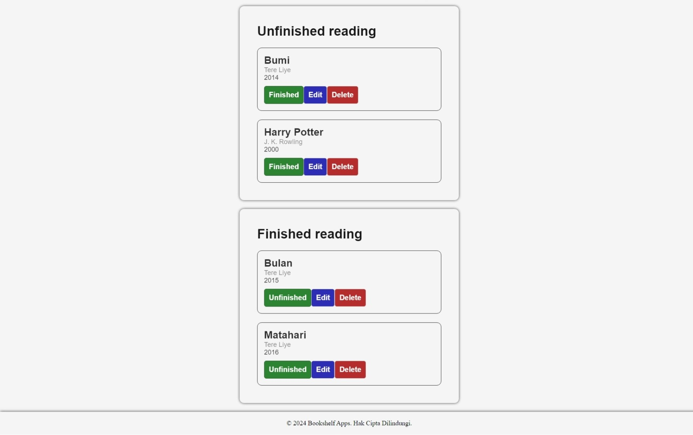

# Bookshelf App

  
  

Bookshelf App is a simple vanilla JavaScript application for managing your book collection.

## Features

- Add new books to the shelf.
- Remove books from the shelf.
- Mark books as read or unread.
- Search and filter books based on various criteria.
- The app is fully responsive and works on all screen sizes.
- The state of the app is saved to local storage, so you can close the app and come back to it later without losing your data.

# Clone Project

1. Clone the repository.
2. Open the `index.html` file in your browser.
3. Use the interface to add, remove, and manage your book collection.

# Usage

1. Visit the deployed version of the app in this repo.
2. Use the interface to add, remove, and manage your book collection.

## Contributions

If you would like to contribute to this project, please fork the repository and submit a pull request. All contributions are highly appreciated.

## License

This project is licensed under the [MIT License](LICENSE). See the [LICENSE](LICENSE) file for more information.

---

© 2024 Moch. Avin

